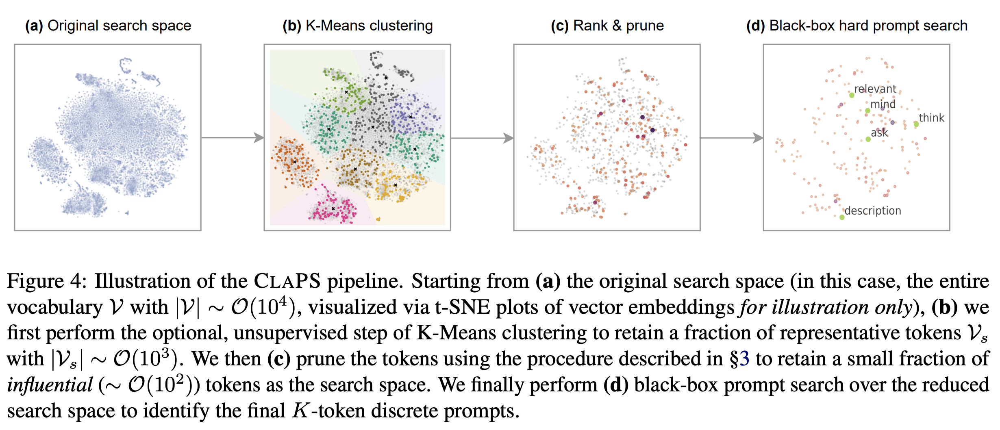

# Code for Survival of the Most Influential Prompts: Efficient Black-Box Prompt Search via Clustering and Pruning


**Link to paper**:
[Survival of the Most Influential Prompts: Efficient Black-Box Prompt Search via Clustering and Pruning](https://arxiv.org/abs/2310.12774) (Findings of EMNLP 2023)

## Installation

Run `source install.sh` to quickly create virtual enviornment named ClaPS and install all dependencies.
```
source install.sh
```

## Quick Start: ClaPS

Use the ```run_prune_search.py``` script as the launch point. We provide a default script as a demo for conducting ClaPS (greedy).

```
sh run_claps.sh
```

## Experiments

1. **Clustering:** We provide pre-generated vocabs for Flan-T5 by k-means++ clustering. To adjust the number of clusters or reinitialize the clustering, please run the following script: ```vocabs/get_kmeans_vocab.ipynb```

2. **Ranking and Pruning:** You can control the pruning strength by adjusting the percentile argument. 

3. **Black-Box Prompt Optimization:** We provide three prompt search algorithms: genetics, greedy, and particle swarm optimization. To define the search algorithm, change it in the method argument.

Lastly, it is worth mentioning that the all prompt search algorithms are sensitive to the intial/manual template defined for instructing the LLM. Feel free to test our ClaPS with your own templates, which can be defined in the ```load_default_template``` function in ```rewards/text_classification_reward.py```.

We acknowledge that some scripts were modified based on RLPrompt.

## Citation

If you find our work to be useful, please cite:

```
@article{zhou2023survival,
  title={Survival of the Most Influential Prompts: Efficient Black-Box Prompt Search via Clustering and Pruning},
  author={Zhou, Han and Wan, Xingchen and Vuli{\'c}, Ivan and Korhonen, Anna},
  journal={arXiv preprint arXiv:2310.12774},
  year={2023}
}
```
